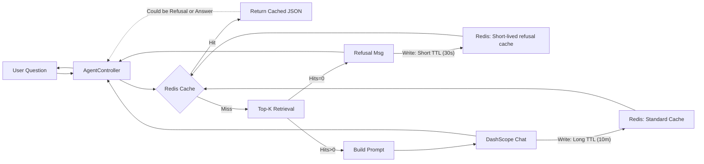
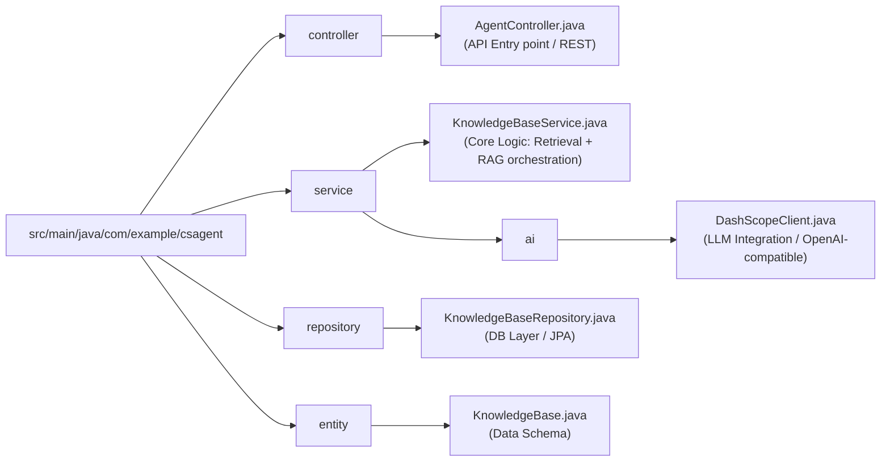

# NetEase Cloud Music Intelligent Customer Support Agent (Minimal RAG)


A lightweight **Retrieval-Augmented Generation (RAG)** backend for high-volume customer support scenarios, with **production-minded engineering** (profiles, Docker infra, caching, and degradation drills).

**Project Page** : <https://chenhongshan333.github.io/NetEase-music-agent-backend-demo/>

---

## Table of Contents
- [Security](#security)
- [Key Features](#key-features)
- [Install](#install)
  - [1. Prerequisites](#1-prerequisites)
  - [2. Set Environment Variable (DashScope)](#2-set-environment-variable-dashscope)
- [Usage](#usage)
  - [1. Rapid Development (Default: H2)](#1-rapid-development-default-h2)
  - [2. Production Simulation (Docker: MySQL + Redis)](#2-production-simulation-docker-mysql--redis)
  - [3. Degradation Drill (Redis Down)](#3-degradation-drill-redis-down)
- [Configuration](#configuration)
  - [Spring Profiles](#spring-profiles)
- [API Reference](#api-reference)
  - [Chat Interface](#chat-interface)
- [Architecture](#architecture)
  - [1. Data Flow (Fail-Fast + Cache + RAG)](#1-data-flow-fail-fast--cache--rag)
  - [2. Repository Structure](#2-repository-structure)
- [Docker Compose Reference](#docker-compose-reference)
- [AI-Assisted Development (Vibe Coding)](#ai-assisted-development-vibe-coding)
- [License](#license)
- [Author](#author)

---

## Security
- **Never commit API keys.** Use env var `DASHSCOPE_API_KEY`.
- If you use `.env`, make sure it’s in `.gitignore`.

---

## Key Features
- Strict Grounding Policy (Fail-Fast)
- Dual-Profile Support (Dev vs Prod Simulation)
- Redis Caching (Hot Query Optimization)
- Minimal Retrieval Baseline (Top-K)
> You can refer to the **Project Page** for more detailed explanation. 
  
---

## Install

### 1. Prerequisites
**Required**
- **JDK 17** (Java 17)
- **Git** (to clone the repo)
- **DashScope API Key** (set as environment variable `DASHSCOPE_API_KEY`)

**Optional (recommended for prod simulation)**
- **Docker Desktop** (to run **MySQL + Redis** via `docker compose`)

> Good news: this repo uses **Maven Wrapper** (`mvnw`), so you **don’t need to install Maven** separately.

### 2. Set Environment Variable (DashScope)

```bash
# Windows (Powershell)
setx DASHSCOPE_API_KEY "your_api_key_here"

# Restart terminal after setx, then verify:
echo $env:DASHSCOPE_API_KEY


# macOS / Linux (bash/zsh)
export DASHSCOPE_API_KEY="your_api_key_here"
echo $DASHSCOPE_API_KEY
```

---

## Usage

> Note (Windows): In **PowerShell**, `curl` may be an alias of `Invoke-WebRequest`.  
> If the commands below fail, use **`curl.exe`** instead (or run in CMD/Git Bash).

### 1. Rapid Development (Default: H2)
Zero infrastructure required.

```bash
# Windows
.\mvnw.cmd spring-boot:run

# macOS / Linux
./mvnw spring-boot:run
```

**After startup:**

* **Swagger UI:** `http://localhost:8080/swagger-ui/index.html`
* **H2 Console:** `http://localhost:8080/h2`

Seed a few KnowledgeBase entries via Swagger UI to reproduce retrieval hits.  
**Example KnowledgeBase payload:**

```json
{
  "question": "怎么取消会员自动续费",
  "answer": "进入 App【个人中心】->【会员中心】->【管理续费】-> 选择订阅并取消。",
  "keywords": "取消 自动续费 会员"
}
```

**Quick test:**

```bash
# Standard
curl -G "http://localhost:8080/api/agent/chat" --data-urlencode "question=怎么取消自动续费"

# PowerShell fallback
curl.exe -G "http://localhost:8080/api/agent/chat" --data-urlencode "question=怎么取消自动续费"
```

### 2. Production Simulation (Docker: MySQL + Redis)

#### 2.1 Start infrastructure
If you already have `docker-compose.yml` in repo root, just run:

```bash
docker compose up -d
docker ps
```

You should see containers like:
* `csagent-mysql`
* `csagent-redis`

**After startup:**

* **Swagger UI:** `http://localhost:8080/swagger-ui/index.html`
* **MySQL (Docker):** connect to `localhost:3306` (db: `netease_agent`)
* **Redis (Docker):** connect to `localhost:6379`

#### 2.2 Run with prod profile

```bash
# Windows (PowerShell)
.\mvnw.cmd spring-boot:run -Dspring-boot.run.profiles=prod

# macOS / Linux
./mvnw spring-boot:run -Dspring-boot.run.profiles=prod
```

#### 2.3 Verify (cache + refusal gate)
1.  Seed KnowledgeBase (same as dev).
2.  Call the same question multiple times:

```bash
# Standard
curl -G "http://localhost:8080/api/agent/chat" --data-urlencode "question=怎么取消自动续费"
curl -G "http://localhost:8080/api/agent/chat" --data-urlencode "question=怎么取消自动续费"

# PowerShell fallback
curl.exe -G "http://localhost:8080/api/agent/chat" --data-urlencode "question=怎么取消自动续费"
curl.exe -G "http://localhost:8080/api/agent/chat" --data-urlencode "question=怎么取消自动续费"
```

**Expected log patterns (typical):**
* **1st request:** `cache=MISS` → `llm=CALL` → `cache=WRITE`
* **2nd request:** `cache=HIT` (no `llm=CALL`)
* **If you ask an unknown question:** `cache=MISS` → `gate=REFUSAL` `hits=0` `llm=SKIP` (and refusal cached with short TTL)

### 3. Degradation Drill (Redis Down)
Goal: prove Redis failure does not break the main request flow.

```bash
# Standard
docker stop csagent-redis
curl -G "http://localhost:8080/api/agent/chat" --data-urlencode "question=怎么取消自动续费"
docker start csagent-redis

# PowerShell fallback
docker stop csagent-redis
curl.exe -G "http://localhost:8080/api/agent/chat" --data-urlencode "question=怎么取消自动续费"
docker start csagent-redis
```

**Expected results:**
* API still returns normally.
* Logs show cache miss + Redis error swallowed (warn only), then fallback to DB/LLM path.

---

## Configuration

### Spring Profiles
Use `dev` by default and switch to `prod` when running with Docker.

**application.properties**
```properties
spring.profiles.default=dev
```

**application-dev.properties** (H2; example)
```properties
spring.datasource.url=jdbc:h2:mem:testdb
spring.datasource.driver-class-name=org.h2.Driver
spring.jpa.hibernate.ddl-auto=update
```

**application-prod.properties** (MySQL + Redis; example)
```properties
# MySQL (prod)
spring.datasource.url=jdbc:mysql://localhost:3306/cs_agent?useSSL=false&allowPublicKeyRetrieval=true&serverTimezone=Asia/Singapore
spring.datasource.username=cs
spring.datasource.password=cs_pass
spring.jpa.hibernate.ddl-auto=update

# Redis (prod)
spring.data.redis.host=localhost
spring.data.redis.port=6379

# Cache policy
agent.cache.enabled=true
agent.cache.ttl-seconds=600
agent.cache.refusal-ttl-seconds=30
```
---

## API Reference

### Chat Interface
`GET /api/agent/chat?question=...`

**Example:**
```bash
curl -G "http://localhost:8080/api/agent/chat" --data-urlencode "question=怎么取消自动续费"
```

**Response:**
```json
{
  "answer": "进入 App【个人中心】->【会员中心】->【管理续费】-> 选择订阅并取消。",
  "hits": 2
}
```

**Behavior:**
* `hits = 0` → fixed refusal (no LLM call)
* `hits > 0` → LLM-generated answer grounded on Known Info

---
## Architecture

### 1. Data Flow (Fail-Fast + Cache + RAG)

1. Input normalization (trim / simple cleanup)
2. Redis cache lookup (hot query optimization)
3. Top-K retrieval from KnowledgeBase (K=5)
4. Refusal gate: if `hits == 0`, return refusal (no LLM)
5. Prompt assembly: inject Known Info
6. LLM inference (DashScope OpenAI-compatible endpoint)
7. Write-back to Redis with TTL (Short TTL for refusals to avoid stale refusals)



### 2. Repository Structure

Key source files map to the architecture above:



---

## Docker Compose Reference
If you don’t already have it, create `docker-compose.yml` in project root:

```yaml
services:
  mysql:
    image: mysql:8.0
    container_name: csagent-mysql
    environment:
      MYSQL_DATABASE: cs_agent
      MYSQL_USER: cs
      MYSQL_PASSWORD: cs_pass
      MYSQL_ROOT_PASSWORD: root_pass
      TZ: Asia/Singapore
    ports:
      - "3306:3306"
    volumes:
      - mysql_data:/var/lib/mysql
    healthcheck:
      test: ["CMD", "mysqladmin", "ping", "-h", "localhost", "-uroot", "-proot_pass"]
      interval: 5s
      timeout: 5s
      retries: 30

  redis:
    image: redis:7-alpine
    container_name: csagent-redis
    command: ["redis-server", "--appendonly", "yes"]
    ports:
      - "6379:6379"
    volumes:
      - redis_data:/data
    healthcheck:
      test: ["CMD", "redis-cli", "ping"]
      interval: 5s
      timeout: 3s
      retries: 30

volumes:
  mysql_data:
  redis_data:
```

**Tip (Windows):** if you don’t have `redis-cli` locally, run it inside the container:
```bash
docker exec -it csagent-redis redis-cli
# then you can run: FLUSHDB
```

---

## AI-Assisted Development (Vibe Coding)
Built with AI assistance using **Cursor** (model: GPT-5.2) in a human-in-the-loop workflow:
- scaffolding Spring Boot wiring
- iterating docs/diagrams
- debugging traces and dependency issues

All changes were manually reviewed and verified via reproducible drills (cache hit/miss + Redis-down degradation).

---
## License
MIT License. See `LICENSE` for details.

---
## Author
Chen Hongshan
