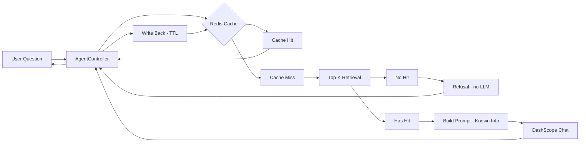

# Netease Cloud Music Intelligent Customer Support Agent (Minimal RAG)


A lightweight **Retrieval-Augmented Generation (RAG)** backend for high-volume customer support scenarios.

This service enforces a **grounded-only** answering policy:
- If retrieval returns **no hit** (`hits == 0`), it returns a fixed refusal message **without invoking the LLM** (fail-fast).
- If `hits > 0`, it injects retrieved KnowledgeBase entries as **Known Info** and constrains the LLM to answer **only** from that context.

---

## Project Background

Customer support queries in music streaming apps (e.g., membership renewal, pricing) are repetitive and high-volume.  
This project demonstrates a minimal RAG pipeline with production-minded engineering choices:

- **Predictable control flow:** synchronous end-to-end pipeline for stability
- **Hallucination containment:** refusal gate when retrieval has no hit
- **Performance optimization:** Redis caching for hot queries (with TTL and graceful degradation)
- **Environment separation:** H2 (dev) vs MySQL + Redis (prod simulation) via Spring Profiles
- **Vendor-agnostic LLM integration:** OpenAI-compatible protocol (DashScope/Qwen by default)

---

## Key Features

### 1) Strict Grounding Policy (Fail-Fast)
- **Hit = 0:** return fixed refusal immediately (**no LLM call**)
- **Hit > 0:** inject “Known Info” and answer **only** based on retrieved context

### 2) Dual-Profile Support (Dev vs Prod Simulation)
- **dev (default):** H2 in-memory, zero infrastructure required
- **prod:** MySQL persistence + Redis caching (Docker Compose), closer to real-world deployment

### 3) Redis Caching (Hot Query Optimization)
- Cache-first: check Redis before retrieval/LLM
- TTL-based write-back on cache miss
- **Stability:** Redis failures degrade gracefully (cache layer does not break the main request path)
- **Correctness note:** refusal responses (`hits==0`) should not be cached for long to avoid stale refusal after KB updates

### 4) Minimal Retrieval Baseline (Top-K)
- Top-K lexical retrieval (K=5) over KnowledgeBase (Spring Data JPA)
- Optional query normalization + retry to improve recall on noisy inputs

---

## Architecture

### Data Flow (Fail-Fast + Cache + RAG)

1. Input normalization (trim / simple cleanup)
2. Redis cache lookup (hot query optimization)
3. Top-K retrieval from KnowledgeBase (K=5)
4. Refusal gate: if `hits == 0`, return refusal (no LLM)
5. Prompt assembly: inject Known Info
6. LLM inference (DashScope OpenAI-compatible endpoint)
7. Write-back to Redis with TTL (on cache miss)


---

## Prompt Policy (Grounded Answering)

The system uses a rigid template to prevent the LLM from using external knowledge.

```text
[System Role]
Persona: NetEase Cloud Music customer support agent
Constraint: Answer ONLY using the provided "Known Info".
Failure Case: If the info is insufficient, reply exactly:
"抱歉，小云暂时还没学会这个问题"
No fabrication allowed.

[User Role]
Known Info:
[1] <retrieved_answer_1>
[2] <retrieved_answer_2>
...
User Question: <question>
```

---

## API Reference

### Chat Interface
`GET /api/agent/chat?question=...`

Response:
```json
{
  "answer": "....",
  "hits": 2
}
```

Behavior:
- `hits = 0` → fixed refusal (no LLM call)
- `hits > 0` → LLM-generated answer grounded on Known Info

---

## Tech Stack

| Component | Choice | Description |
| --- | --- | --- |
| Language | Java 17 | Core development language |
| Framework | Spring Boot 3.x | Web MVC and dependency injection |
| Database (dev) | H2 | Zero-infra rapid development |
| Database (prod) | MySQL 8 | Persistence for production simulation |
| Cache (prod) | Redis 7 | Hot query caching with TTL |
| LLM Integration | OkHttp + Jackson | OpenAI-compatible chat completion client |
| API Docs | OpenAPI / Swagger UI | API exploration and testing |
| Deployment | Docker Compose | One-command infra startup |

---

## Repository Structure

- `controller/AgentController.java` — request entry, response shaping
- `service/KnowledgeBaseService.java` — retrieval + normalization retry
- `repo/KnowledgeBaseRepository.java` — JPA query layer
- `entity/KnowledgeBase.java` — KnowledgeBase schema
- `service/ai/DashScopeClient.java` — LLM client (OpenAI-compatible protocol)

---

## Configuration

### Environment Variables
- `DASHSCOPE_API_KEY` (required)

**macOS/Linux**
```bash
export DASHSCOPE_API_KEY="your_api_key_here"
```

**Windows (PowerShell)**
```powershell
setx DASHSCOPE_API_KEY "your_api_key_here"
```

### Spring Profiles
Use `dev` by default and switch to `prod` when running with Docker.

**application.properties**
```properties
spring.profiles.default=dev
```

**application-dev.properties** (H2; keep your existing settings)
```properties
# H2 Config (example)
spring.datasource.url=jdbc:h2:mem:testdb
spring.datasource.driver-class-name=org.h2.Driver
spring.jpa.hibernate.ddl-auto=update
```

**application-prod.properties** (MySQL + Redis)
```properties
# MySQL
spring.datasource.url=jdbc:mysql://localhost:3306/netease_agent?useSSL=false&allowPublicKeyRetrieval=true&serverTimezone=UTC
spring.datasource.username=agent
spring.datasource.password=agentpass
spring.datasource.driver-class-name=com.mysql.cj.jdbc.Driver
spring.jpa.hibernate.ddl-auto=update

# Redis
spring.data.redis.host=localhost
spring.data.redis.port=6379
```

---

## Getting Started

### 1) Rapid Development (Default: H2)
Zero infrastructure required.

```bash
mvn spring-boot:run
```

After startup:
- Swagger UI: `http://localhost:8080/swagger-ui/index.html`
- H2 Console: `http://localhost:8080/h2`

Seed a few KnowledgeBase entries via Swagger UI to reproduce retrieval hits.

Example KnowledgeBase payload:
```json
{
  "question": "怎么取消会员自动续费",
  "answer": "进入 App【个人中心】->【会员中心】->【管理续费】-> 选择订阅并取消。",
  "keywords": "取消 自动续费 会员"
}
```

Quick test:
```bash
curl -G "http://localhost:8080/api/agent/chat" --data-urlencode "question=怎么取消会员自动续费"
```

### 2) Production Simulation (Docker: MySQL + Redis)

Start infrastructure:
```bash
docker-compose up -d
```

Run with prod profile:
```bash
mvn spring-boot:run -Dspring.profiles.active=prod
```

---

## Docker Compose (Reference)

Create `docker-compose.yml` in project root:

```yaml
version: "3.8"

services:
  mysql:
    image: mysql:8.0
    container_name: netease-agent-mysql
    environment:
      MYSQL_ROOT_PASSWORD: rootpass
      MYSQL_DATABASE: netease_agent
      MYSQL_USER: agent
      MYSQL_PASSWORD: agentpass
    ports:
      - "3306:3306"
    volumes:
      - mysql_data:/var/lib/mysql
      # - ./docker/mysql/init:/docker-entrypoint-initdb.d
    healthcheck:
      test: ["CMD", "mysqladmin", "ping", "-h", "localhost", "-prootpass"]
      interval: 5s
      timeout: 5s
      retries: 20

  redis:
    image: redis:7-alpine
    container_name: netease-agent-redis
    ports:
      - "6379:6379"
    command: ["redis-server", "--appendonly", "yes"]
    volumes:
      - redis_data:/data
    healthcheck:
      test: ["CMD", "redis-cli", "ping"]
      interval: 5s
      timeout: 3s
      retries: 20

volumes:
  mysql_data:
  redis_data:
```

---

## Operational Notes

- **Fail-fast refusal:** if `hits == 0`, return refusal without calling LLM (cost/latency saving, groundedness)
- **Cache degradation:** Redis issues should not break the main request path (fallback to retrieval + LLM)
- **Cache TTL:** keep TTL configurable; avoid long caching for `hits==0` refusal to prevent stale behavior after KB updates
- **Default dev mode:** H2 in-memory is for rapid iteration; use `prod` profile for persistence + caching simulation

---

## Roadmap

- [ ] Semantic search (embedding-based retrieval: pgvector / Milvus), keep lexical as fallback (hybrid)
- [ ] Observability (structured logs + tracing + metrics)
- [ ] Evaluation harness (offline test set + groundedness checks)
- [ ] Admin tooling (KB import/export, moderation workflow)

---

## Screenshots (Recommended)

Add real screenshots under `docs/` to improve scanability:

- `docs/swagger.png`
- `docs/response.png`

Example:

```markdown
## Screenshots

### Swagger UI


### Example Response

```

---

## License
MIT

---

## Author
Chen Hongshan
